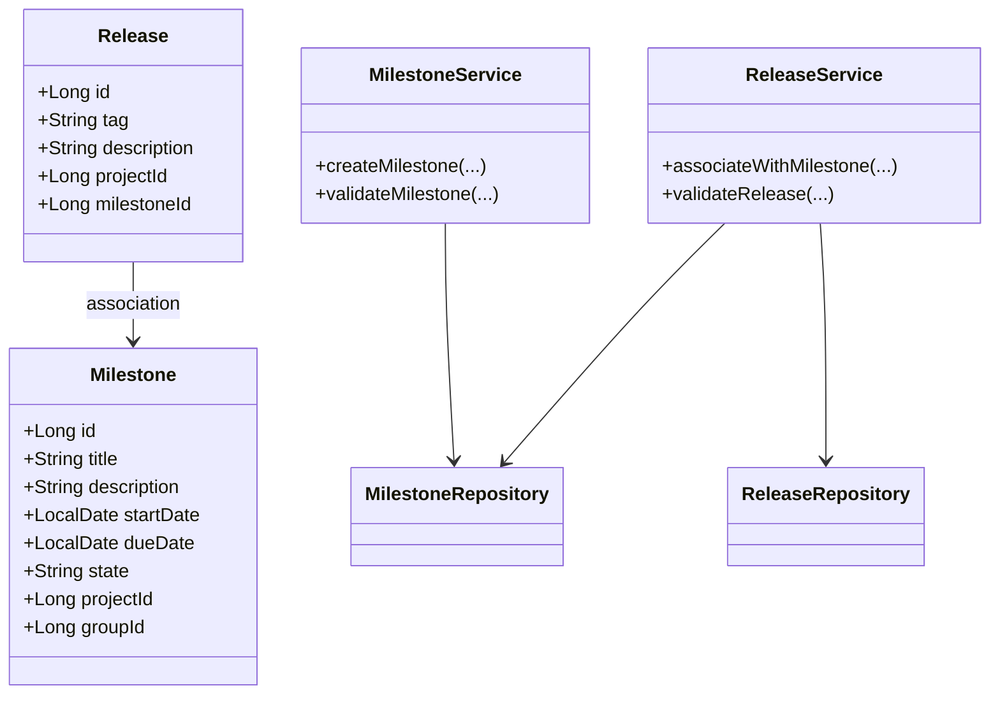
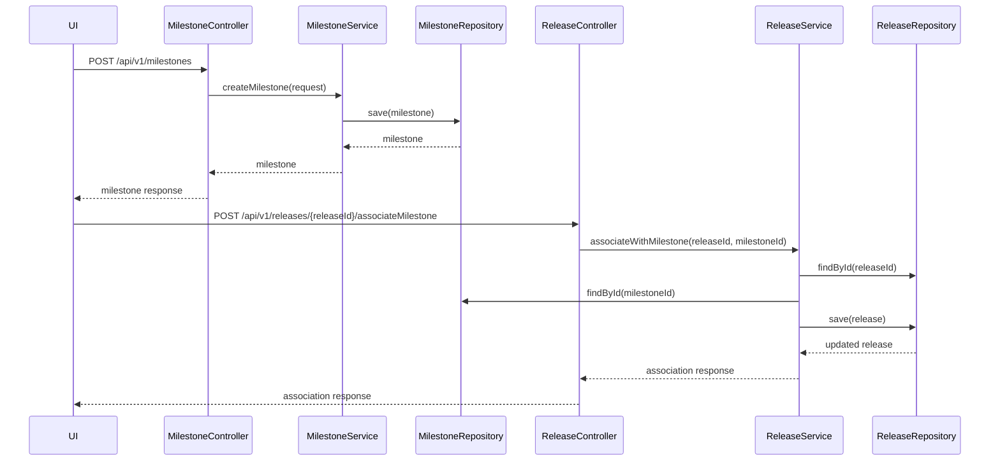
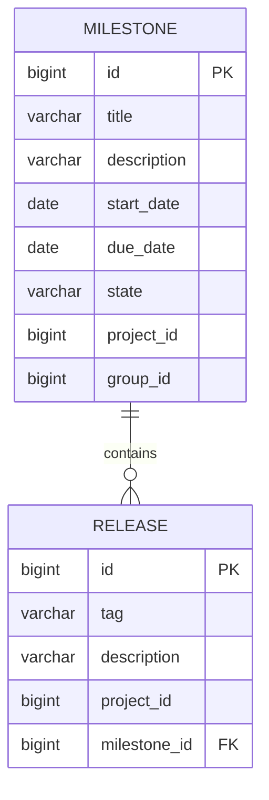

# Low-Level Design (LLD): Milestone Creation and Release Association

## 1. Objective
This document details the low-level design for two key features in the GitLab application server: (1) creating a milestone within a project or group, and (2) associating a release with a milestone. The goal is to enable project managers and developers to track project progress and feature inclusion efficiently. The design ensures robust validation, atomic operations, and high concurrency handling, leveraging Spring Boot and PostgreSQL for implementation. All APIs, models, and integrations are consolidated for a production-ready solution.

## 2. API Model

### 2.1 Common Components/Services
- **MilestoneService**: Handles logic for milestone creation and management.
- **ReleaseService**: Manages release creation and association with milestones.
- **MilestoneRepository**: Data access layer for milestones.
- **ReleaseRepository**: Data access layer for releases.
- **ValidationUtils**: Utility for business and data validations.
- **ExceptionHandler**: Centralized exception management.

### 2.2 API Details
| Operation                        | REST Method | Type     | URL                                         | Request JSON                                                                                   | Response JSON                                                                                       |
|----------------------------------|-------------|----------|----------------------------------------------|-----------------------------------------------------------------------------------------------|-----------------------------------------------------------------------------------------------------|
| Create Milestone                 | POST        | Success  | /api/v1/milestones                          | { "title": "string", "description": "string", "startDate": "yyyy-MM-dd", "dueDate": "yyyy-MM-dd", "projectId": "long", "groupId": "long (optional)" } | { "id": "long", "title": "string", "description": "string", "startDate": "yyyy-MM-dd", "dueDate": "yyyy-MM-dd", "state": "active", "projectId": "long", "groupId": "long (optional)" } |
| Create Milestone                 | POST        | Failure  | /api/v1/milestones                          | { ... }                                                                                       | { "error": "Milestone title must be unique within the project or group." }                       |
| Associate Release with Milestone | POST        | Success  | /api/v1/releases/{releaseId}/associateMilestone | { "milestoneId": "long" }                                                                  | { "releaseId": "long", "milestoneId": "long", "status": "associated" }                         |
| Associate Release with Milestone | POST        | Failure  | /api/v1/releases/{releaseId}/associateMilestone | { ... }                                                                                       | { "error": "Release tag must be unique within the project." }                                    |

### 2.3 Exceptions
- **MilestoneTitleNotUniqueException**: Thrown when a milestone title is not unique within a project or group.
- **InvalidDateRangeException**: Thrown when the start date is after the due date.
- **ReleaseTagNotUniqueException**: Thrown when a release tag is not unique within a project.
- **ReleaseAlreadyAssociatedException**: Thrown when a release is already associated with a milestone.
- **MilestoneNotFoundException**: Thrown when the milestone to associate is not found.
- **DatabaseConcurrencyException**: Thrown on concurrent update conflicts.

## 3. Functional Design

### 3.1 Class Diagram

### 3.2 UML Sequence Diagram

### 3.3 Components
| Component Name        | Purpose                                             | New/Existing |
|----------------------|-----------------------------------------------------|--------------|
| MilestoneService     | Business logic for milestones                       | New          |
| ReleaseService       | Business logic for releases and associations        | New          |
| MilestoneRepository  | Data access for milestones                          | New          |
| ReleaseRepository    | Data access for releases                            | New          |
| ValidationUtils      | Common validation logic                             | New          |
| ExceptionHandler     | Centralized exception handling                      | New          |

### 3.4 Service Layer Logic and Validations
| FieldName        | Validation                                              | ErrorMessage                                           | ClassUsed           |
|------------------|--------------------------------------------------------|--------------------------------------------------------|---------------------|
| title            | Unique within project/group                             | Milestone title must be unique within the project/group | MilestoneService    |
| startDate, dueDate| startDate <= dueDate                                   | Start date must be before or equal to due date         | MilestoneService    |
| tag              | Unique within project                                  | Release tag must be unique within the project          | ReleaseService      |
| milestoneId      | Exists in DB                                           | Milestone not found                                    | ReleaseService      |
| releaseId        | Exists in DB                                           | Release not found                                      | ReleaseService      |
| releaseId        | Not already associated with a milestone                | Release already associated with a milestone            | ReleaseService      |

## 4. Integrations
| SystemToBeIntegrated | IntegratedFor                  | IntegrationType |
|---------------------|-------------------------------|-----------------|
| PostgreSQL          | Milestone and Release storage  | DB              |
| GitLab UI           | Milestone and Release features | API             |
| GitLab API          | Milestone and Release features | REST/GraphQL    |

## 5. DB Details

### 5.1 ER Model

### 5.2 DB Validations
- **milestone.title**: Unique constraint on (project_id, title) and (group_id, title)
- **milestone.start_date, milestone.due_date**: Check constraint (start_date <= due_date)
- **release.tag**: Unique constraint on (project_id, tag)
- **release.milestone_id**: Foreign key to milestone.id; nullable (only one milestone per release)
- **release.milestone_id**: Unique constraint (a release can be associated with only one milestone)

## 6. Dependencies
- Spring Boot 2.x/3.x
- Spring Data JPA
- PostgreSQL
- GitLab UI and API clients
- Validation framework (Hibernate Validator)

## 7. Assumptions
- Each milestone is unique within a project or group (not both simultaneously).
- A release can only be associated with one milestone at a time.
- The system will handle concurrent requests using database-level constraints and optimistic locking.
- All date fields are in UTC and ISO 8601 format.
- The API is secured and only authenticated users can create milestones or associate releases.
- The UI and API clients will handle error messages as per the response structure.

---

*This LLD is consolidated for all user stories in the current Jira iteration and is ready for direct implementation in a Spring Boot/PostgreSQL environment.*

[//]: # (JIRA_LINK: TEST-1234)
