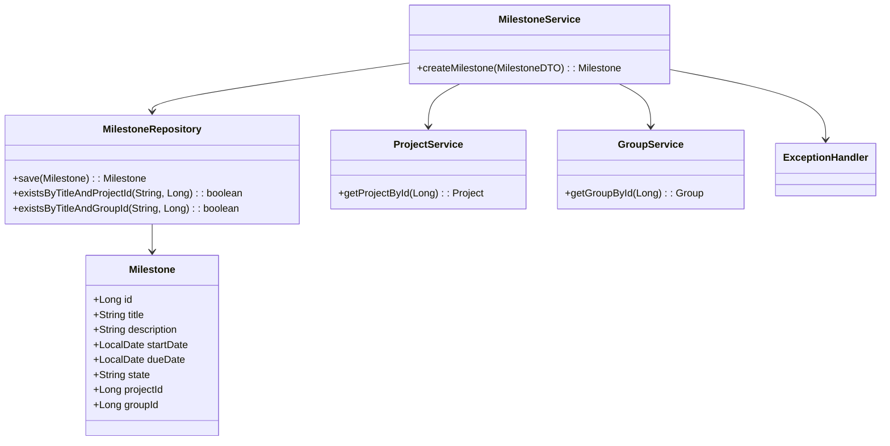
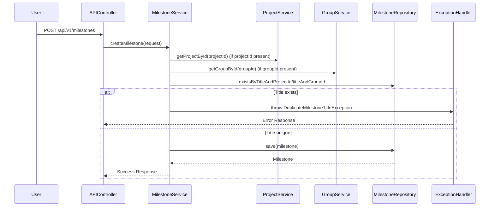
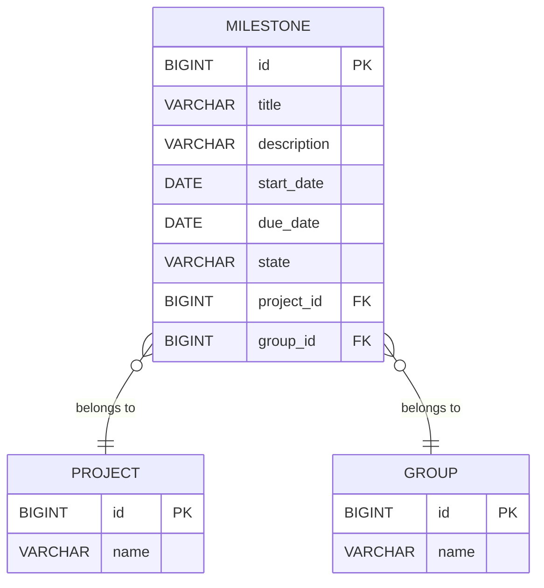

# Low-Level Design (LLD) for Milestone Creation Feature

## 1. Objective- Amresh - Raghunath - Vibek

The goal of this feature is to enable project managers to create milestones within a project or group in the GitLab application. Each milestone will have a unique title (within its scope), a description, a start date, and a due date. The system will ensure that milestones are uniquely identified within their project or group, enforce business and validation rules, and persist all milestone data in a PostgreSQL database. The design will support high concurrency and meet strict performance requirements.

---

## 2. API Model

### 2.1 Common Components/Services

- **MilestoneService**: Handles business logic for milestone creation and validation.
- **MilestoneRepository**: Interface for database operations related to milestones.
- **ProjectService**: Service to fetch and validate project details.
- **GroupService**: Service to fetch and validate group details.
- **ExceptionHandler**: Handles API exceptions and validation errors.

### 2.2 API Details

| Operation                 | REST Method | Type     | URL                                 | Request JSON                                                                                   | Response JSON                                                                                 |
|---------------------------|-------------|----------|-------------------------------------|------------------------------------------------------------------------------------------------|-----------------------------------------------------------------------------------------------|
| Create Milestone          | POST        | Success  | /api/v1/milestones                  | {   "title": "Release v1",   "description": "First release milestone",   "startDate": "2024-07-01",   "dueDate": "2024-07-31",   "projectId": 1001,   "groupId": null } | {   "id": 1,   "title": "Release v1",   "description": "First release milestone",   "startDate": "2024-07-01",   "dueDate": "2024-07-31",   "state": "active",   "projectId": 1001,   "groupId": null } |
| Create Milestone (Failure)| POST        | Failure  | /api/v1/milestones                  | {   "title": "Release v1",   "description": "Duplicate milestone",   "startDate": "2024-07-01",   "dueDate": "2024-07-31",   "projectId": 1001,   "groupId": null } | {   "error": "Milestone title must be unique within the project or group." }            |
| Create Milestone (Invalid)| POST        | Failure  | /api/v1/milestones                  | {   "title": "Sprint 2",   "description": "Invalid dates",   "startDate": "2024-08-01",   "dueDate": "2024-07-31",   "projectId": 1001,   "groupId": null } | {   "error": "Start date must be before or equal to due date." }                       |

### 2.3 Exceptions

| Scenario                                            | Exception Name                  | Description                                              |
|-----------------------------------------------------|---------------------------------|----------------------------------------------------------|
| Duplicate milestone title within project/group      | DuplicateMilestoneTitleException| Thrown when a milestone with the same title exists       |
| Start date after due date                           | InvalidMilestoneDateException   | Thrown when start date is after due date                 |
| Project or group not found                          | ProjectOrGroupNotFoundException | Thrown when referenced project or group does not exist   |
| Database constraint violation                       | DataIntegrityViolationException | Thrown on DB constraint errors (e.g., unique violation)  |

---

## 3. Functional Design

### 3.1 Class Diagram

### 3.2 UML Sequence Diagram

### 3.3 Components

| Component Name         | Purpose                                             | New/Existing |
|-----------------------|-----------------------------------------------------|--------------|
| MilestoneService      | Business logic for milestone creation/validation    | New          |
| MilestoneRepository   | DB operations for milestones                        | New          |
| ProjectService        | Fetch/validate project details                      | Existing     |
| GroupService          | Fetch/validate group details                        | Existing     |
| ExceptionHandler      | Handle and map exceptions to API responses          | Existing     |

### 3.4 Service Layer Logic and Validations

| FieldName   | Validation                                 | ErrorMessage                                         | ClassUsed           |
|-------------|--------------------------------------------|------------------------------------------------------|---------------------|
| title       | Must be unique within project or group     | Milestone title must be unique within the project or group. | MilestoneService    |
| startDate   | Must be before or equal to dueDate         | Start date must be before or equal to due date.      | MilestoneService    |
| projectId   | Must refer to an existing project (if set) | Project not found.                                   | ProjectService      |
| groupId     | Must refer to an existing group (if set)   | Group not found.                                     | GroupService        |

---

## 4. Integrations

| SystemToBeIntegrated | IntegratedFor         | IntegrationType |
|----------------------|----------------------|-----------------|
| PostgreSQL           | Milestone persistence| DB              |
| Project Service      | Project validation   | Internal API    |
| Group Service        | Group validation     | Internal API    |

---

## 5. DB Details

### 5.1 ER Model

### 5.2 DB Validations

- Unique constraint: `(title, project_id)` must be unique when `project_id` is not null
- Unique constraint: `(title, group_id)` must be unique when `group_id` is not null
- `start_date` <= `due_date` (enforced in service layer)
- `project_id` or `group_id` must be present (at least one not null)

---

## 6. Non-Functional Requirements

### 6.1 Performance

- Milestone creation must complete within 2 seconds.
- Use DB-level unique constraints for fast duplicate detection.
- Use indexes on `(title, project_id)` and `(title, group_id)` for efficient lookups.
- Consider optimistic locking or transactions to handle concurrency.

### 6.2 Security
#### 6.2.1 Authentication

- All API endpoints require JWT or OAuth2 authentication.

#### 6.2.2 Authorization

- Only users with "Project Manager" or higher role can create milestones.

### 6.3 Logging

#### 6.3.1 Application Logging

- Log all milestone creation requests and responses at INFO level.
- Log validation and business errors at WARN level.

#### 6.3.2 Audit Log

- Record audit entries for milestone creation with user, timestamp, and milestone data.

---

## 7. Dependencies

- Spring Boot Framework (Web, Data JPA, Security)
- PostgreSQL database
- Project Service (internal)
- Group Service (internal)

---

## 8. Assumptions

- Either `projectId` or `groupId` must be provided in the request (not both null).
- The user is authenticated and authorized to create milestones in the specified project/group.
- Project and group entities already exist in the system.
- No soft deletes for milestones (all are persisted unless explicitly deleted).
- Date fields are provided in ISO 8601 format (YYYY-MM-DD).
- The system is horizontally scalable to handle concurrent requests.